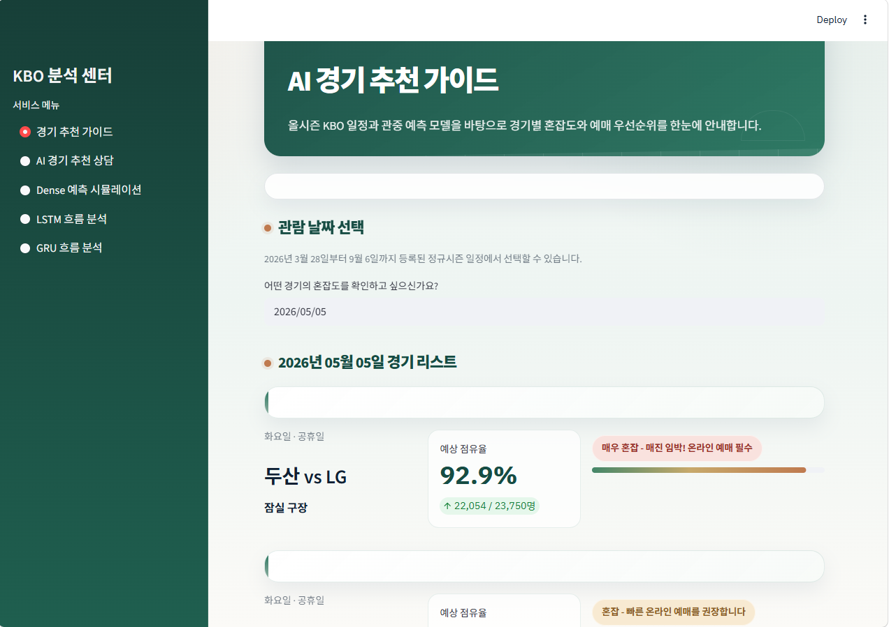

# KBO Attendance Prediction

KBO 경기 관중 수를 예측하고, 예매 혼잡도와 추천 경기를 Streamlit 화면에서 확인할 수 있는 프로젝트입니다.

## 배포 주소

- Streamlit 앱: [https://kbo-attendance-prediction-llm.streamlit.app/](https://kbo-attendance-prediction-llm.streamlit.app/)

## 실행 화면



## 주요 기능

- 경기별 예상 관중 수 예측
- 예매 혼잡도 및 점유율 안내
- 추천 경기 가이드
- Dense 예측 시뮬레이션
- LSTM 흐름 분석
- GRU 흐름 분석

## 프로젝트 구성

- `app.py`: Streamlit 기반 메인 대시보드
- `train_all_models.py`: Dense, LSTM, GRU 모델 학습 스크립트
- `data/kbo_attendance.csv`: 2024-2026 시즌 경기 관중 데이터
- `models/`: 학습된 모델 파일
- `artifacts/`: 인코더, 스케일러, 비교 지표 등 예측 보조 파일
- `baseball_attendance_analysis.ipynb`: 기본 전처리 및 Dense 모델 실험
- `kbo_llm_extension_analysis.ipynb`: 추가 분석 및 확장 실험

## 사용 특징

- 홈팀
- 원정팀
- 구장
- 월
- 요일
- 주말 여부
- 공휴일 여부
- 라이벌전 여부
- 시즌

## 로컬 실행 방법

```bash
pip install -r requirements.txt
streamlit run app.py
```

Streamlit은 실행 환경에 따라 `8501`, `8502`, `8503` 등 다른 포트로 열릴 수 있습니다.
